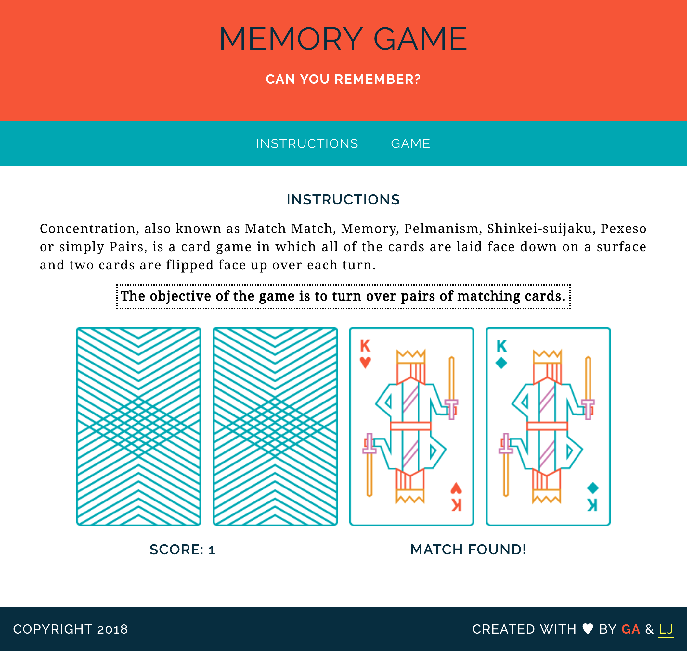

# Memory Game
> General Assembly Web Development Intensive Pre-Work

A simple [card matching](https://en.wikipedia.org/wiki/Concentration_(game)) game that can be played in the browser.

## Getting Started
Clone or download the repository and open index.html to play.

```
git clone https://github.com/lamesensei/wdi-fundamentals-memorygame.git
```

## Screenshots


## Built With
 - HTML
 - CSS
 - Javascript

## Authors
- Phua Liang Jun - _Coding and modifications_
- General Assembly - _Initial instructions/template_
